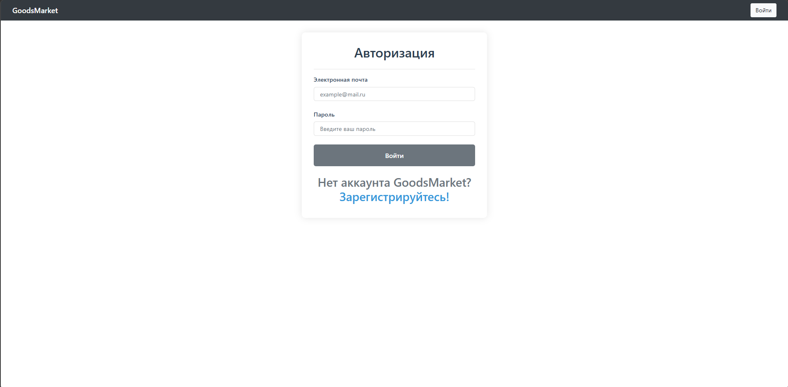
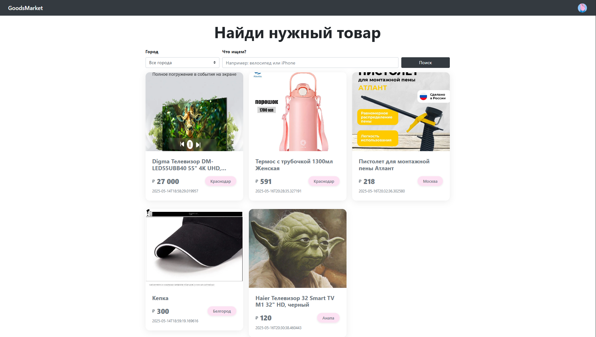
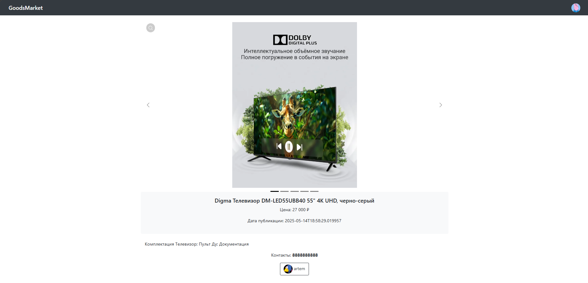
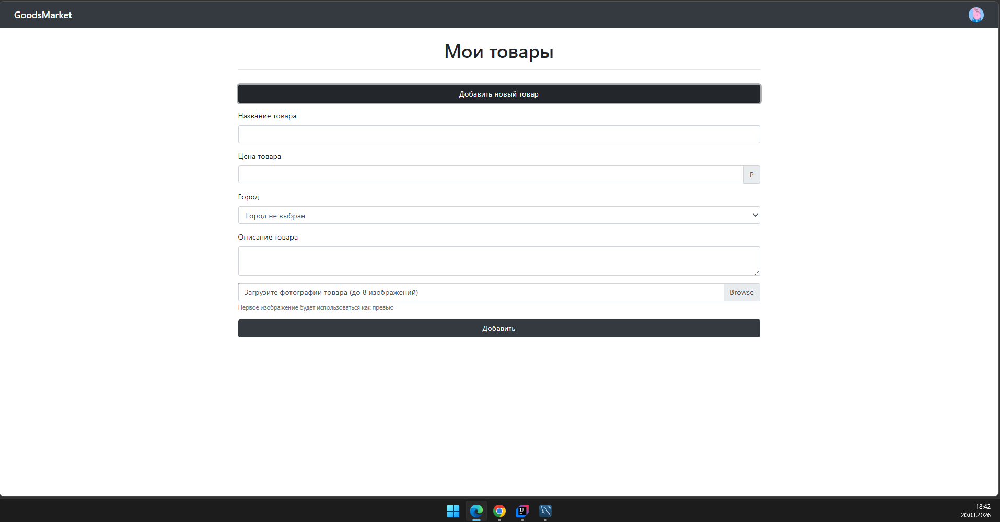

# GoodsMarket — Платформа для размещения товаров

**GoodsMarket** — это веб-приложение на Spring Boot, позволяющее пользователям публиковать объявления о продаже товаров, управлять своим профилем, искать предложения по городу и ключевым словам, а также взаимодействовать с другими пользователями. Администратор обладает расширенными правами для управления пользователями.
### Авторизация

### Основная страница

### Страница товара

### Страница добавления продукта


---

## Функции

- 🔐 **Регистрация и аутентификация**
  - Регистрация с подтверждением email (ссылка активации)
  - Вход по email и паролю  - Роли: `ROLE_USER` (обычный пользователь), `ROLE_ADMIN` (администратор)
  - Хеширование паролей 

- 📝 **Управление товарами**
  - Добавление товара с названием, описанием, ценой, городом и до 8 изображениями
  - Редактирование и удаление своих товаров
  - Просмотр страницы товара с детальной информацией и фотографиями

- 👤 **Личный кабинет**
  - Просмотр и редактирование профиля (имя, телефон, аватар)
  - Список всех своих товаров на отдельной странице

- 🔍 **Поиск и фильтрация**
  - Поиск товаров по городу
  - Поиск по ключевому слову в названии или описании

- 🛡️ **Администрирование**
  - Список всех пользователей с возможностью бана/разбана
  - Редактирование ролей пользователей (USER, ADMIN)

## Используемые технологии

| Технология       | Назначение                          |
|------------------|-------------------------------------|
| Java 11+         | Язык разработки                     |
| Spring Boot      | Основной фреймворк                  |
| Spring Security  | Аутентификация и авторизация        |
| Spring Data JPA  | Работа с базой данных               |
| Hibernate        | ORM                                 |
| FreeMarker       | Шаблонизатор представлений          |
| MySQL            | База данных (может быть заменена)   |
| Maven            | Сборка и управление зависимостями   |
| Lombok           | Сокращение шаблонного кода          |
| Spring Mail      | Отправка писем для активации        |

## Структура проекта
```
GoodsMarket/
├── src/main/java/com.example.GoodsMarket/
│ ├── configurations/ # Конфигурации (Security, Mvc)
│ │ ├── MvcConfig.java
│ │ └── SecurityConfig.java
│ ├── controllers/ # Контроллеры
│ │ ├── AdminController.java
│ │ ├── ImageController.java
│ │ ├── ProductController.java
│ │ └── UserController.java
│ ├── models/ # Сущности JPA и перечисления
│ │ ├── enums/
│ │ │ └── Role.java
│ │ ├── Image.java
│ │ ├── Product.java
│ │ └── User.java
│ ├── repositories/ # Репозитории Spring Data
│ │ ├── ImageRepository.java
│ │ ├── ProductRepository.java
│ │ └── UserRepository.java
│ ├── services/ # Сервисный слой
│ │ ├── UserService.java
│ │ ├── ProductService.java
│ │ └── CustomUserDetailsService.java
│ └── GoodsMarketApplication.java # Точка входа
├── src/main/resources/
│ ├── static/ # Статические ресурсы
│ │ ├── css/style.css
│ │ └── images/avatar.png
│ ├── templates/ # FreeMarker шаблоны
│ │ ├── blocks/template.fth # Базовый макет
│ │ ├── admin.fth
│ │ ├── edit-product.fth
│ │ ├── edit-profile.fth
│ │ ├── login.fth
│ │ ├── my-products.fth
│ │ ├── product-info.fth
│ │ ├── products.fth
│ │ ├── profile.fth
│ │ ├── registration.fth
│ │ ├── user-edit.fth
│ │ └── user-info.fth
│ └── application.properties # Конфигурация приложения
├── .gitignore
├── mvnw, mvnw.cmd
└── pom.xml
```
## Как запустить локально

### Предварительные условия
- JDK 11 или выше
- Maven (можно использовать встроенный `mvnw`)
- MySQL (или другая БД, поддерживаемая Hibernate)
- Git

### Шаги

1. **Клонировать репозиторий**
   ```bash
   git clone https://github.com/yourusername/GoodsMarket.git
   cd GoodsMarket
   ```

2. **Настроить базу данных**
   
   Создайте базу данных MySQL (например, `goods_market`).  
   Отредактируйте `src/main/resources/application.properties`, указав свои параметры подключения:
   ```properties
   spring.datasource.url=jdbc:mysql://localhost:3306/goodsmarket
   spring.datasource.username=your_username
   spring.datasource.password=your_password
   spring.jpa.hibernate.ddl-auto=update
   ```

3. **Настроить почту для активации (опционально)**
   
   В `application.properties` добавьте параметры SMTP, если требуется отправка писем:
   ```properties
   spring.mail.host=smtp.gmail.com
   spring.mail.port=587
   spring.mail.username=your_email@gmail.com
   spring.mail.password=your_app_password
   spring.mail.properties.mail.smtp.auth=true
   spring.mail.properties.mail.smtp.starttls.enable=true
   ```

4. **Запустить приложение**

   Найдите основной класс
   В дереве проекта перейдите по пути:

   ```
   src/main/java/com.example.GoodsMarket/GoodsMarketApplication.java
   ```

   Кликните правой кнопкой мыши по файлу GoodsMarketApplication.java

   Выберите Run 'GoodsMarketApplication.main()' (или зелёный треугольник слева от класса)

5. **Открыть в браузере**
   
   Перейдите по адресу: [http://localhost:8080](http://localhost:8080)

## Панель администратора

Доступ: только для пользователей с ролью `ROLE_ADMIN`.  
URL: `/admin`

Возможности:
- Просмотр всех зарегистрированных пользователей
- Бан/разбан пользователя (после бана пользователь не может войти)
- Редактирование ролей пользователя (назначение `ADMIN` или снятие)

Для получения прав администратора можно вручную добавить роль в БД или создать пользователя с ролью `ADMIN` через консоль.

## Как использовать

1. **Регистрация**
- Перейдите на страницу `/registration`.
 - Заполните поля: имя, email, номер телефона, пароль.
 - Нажмите «Зарегистрироваться».
 - Перейдите по ссылке активации, отправленной на указанный email (если настроена почта). Если почта не настроена, код активации можно скопировать из консоли (выводится при регистрации).


2. **Вход в систему**
- Перейдите на `/login`, введите email и пароль.


3. **Создание товара**
 - После входа нажмите на своё имя в шапке → «Мои товары».
- Нажмите «Добавить товар».
 - Заполните форму: название, описание, цену, город, загрузите до 8 изображений.
- Нажмите «Сохранить».


 4. **Просмотр и поиск товаров**

   - На главной странице отображаются все активные товары.
  - Можно искать по городу (выпадающий список) и по ключевому слову (в названии или описании).
   - При клике на товар открывается его страница с подробной информацией и контактами автора.


  5. **Редактирование профиля**
  - Нажмите на своё имя в шапке → «Профиль».
  - Нажмите «Редактировать профиль».
 - Измените имя, телефон, загрузите новый аватар.
 - Нажмите «Сохранить».


  6. **Управление своими товарами**
   - Перейдите в «Мои товары».
   - Рядом с каждым товаром есть кнопки «Редактировать» и «Удалить».


  7. **Выход**
  - Нажмите на своё имя → «Выйти».
